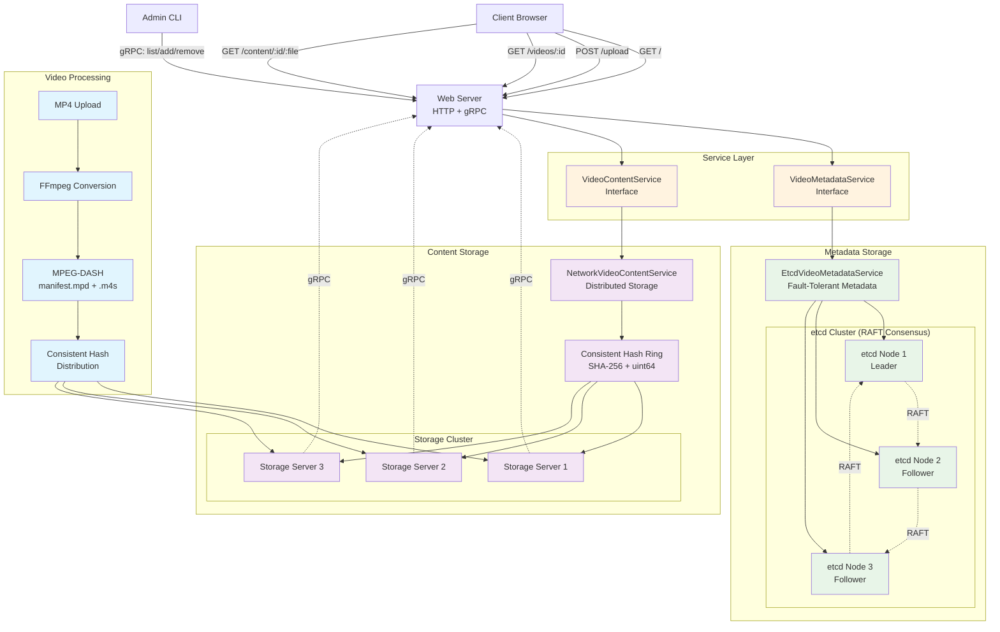

# Distributed-Video-Storage

## Architecture Overview
TritonTube is built with a microservices architecture featuring distributed storage, consistent hashing, and RAFT consensus for fault tolerance.

## Key Components
### Web Server

- HTTP API: Handles video upload, streaming, and web interface
- gRPC Interface: Admin operations for cluster management
- Service Layer: Abstracts metadata and content storage

### Metadata Storage (etcd)

- 3-Node Cluster: RAFT consensus for fault tolerance
- Leader Election: Automatic failover on node failures
- Consistent State: Video metadata and cluster information

### Content Storage

- Consistent Hashing: SHA-256 based distribution across storage nodes
- Storage Servers: Independent nodes storing video files
- Dynamic Scaling: Add/remove nodes with automatic file migration

### Video Processing

- FFmpeg Integration: MP4 to MPEG-DASH conversion
- Adaptive Streaming: Multiple bitrates for optimal playback
- Segment Distribution: Files spread across storage cluster

### Data Flow

- Upload: Client uploads MP4 → Web server processes → FFmpeg converts to MPEG-DASH
- Distribution: Consistent hash determines storage location → Files distributed to storage nodes
- Metadata: Video information stored in etcd cluster with RAFT consensus
- Streaming: Client requests video → Hash lookup → Retrieve from appropriate storage node

### Key Features

- Horizontal Scaling: Add storage nodes dynamically
- Fault Tolerance: Survives storage and metadata node failures
- Load Balancing: Consistent hashing ensures even distribution
- Zero Downtime: File migration during cluster changes
- Admin Interface: CLI for cluster management

### Tech Stack

Backend: Go with gRPC and HTTP servers
Consensus: etcd with RAFT protocol
Video Processing: FFmpeg for MPEG-DASH conversion
Communication: Protocol Buffers for service communication
Hashing: SHA-256 for consistent distribution

## Project Structure
├── cmd/
│   ├── admin/          # Admin CLI
│   ├── storage/        # Storage server
│   └── web/           # Web server
├── internal/
│   ├── proto/         # gRPC definitions
│   ├── storage/       # Storage implementation
│   └── web/          # Web server logic
└── proto/             # Protocol buffer files
